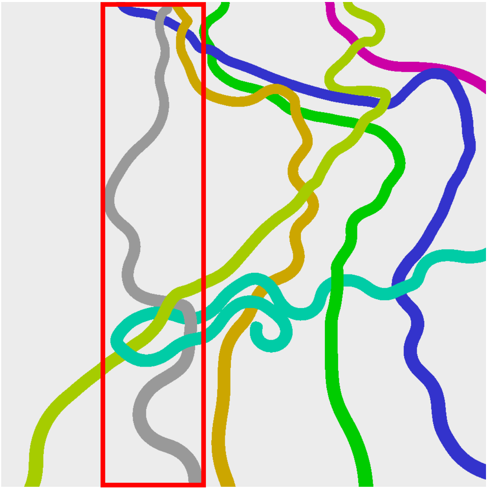
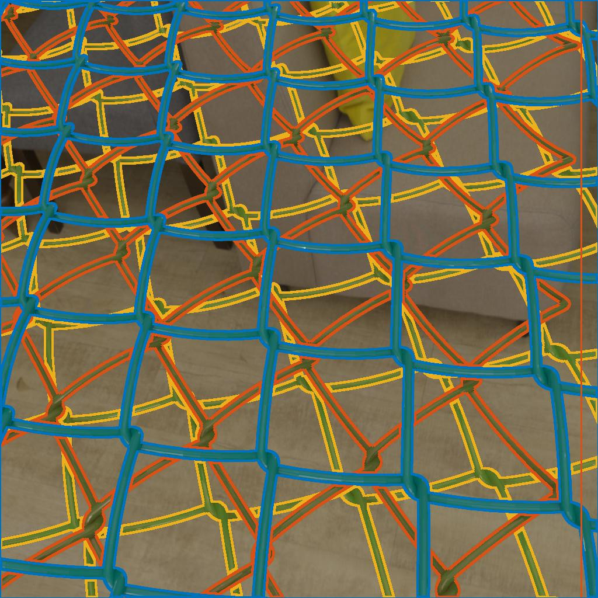
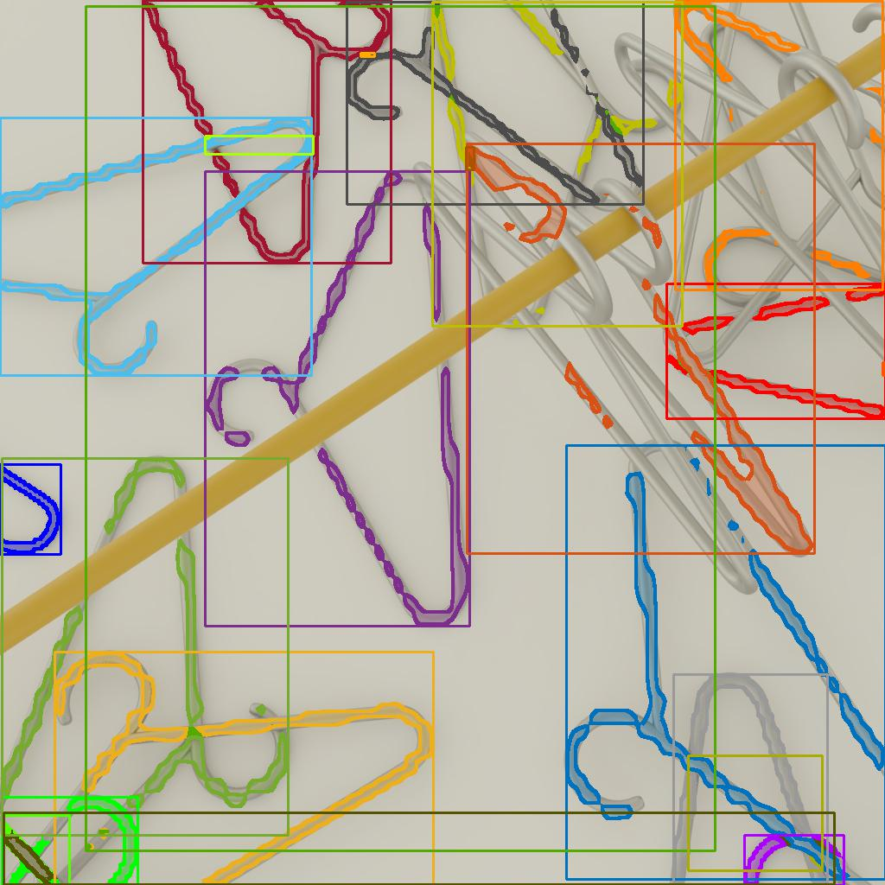
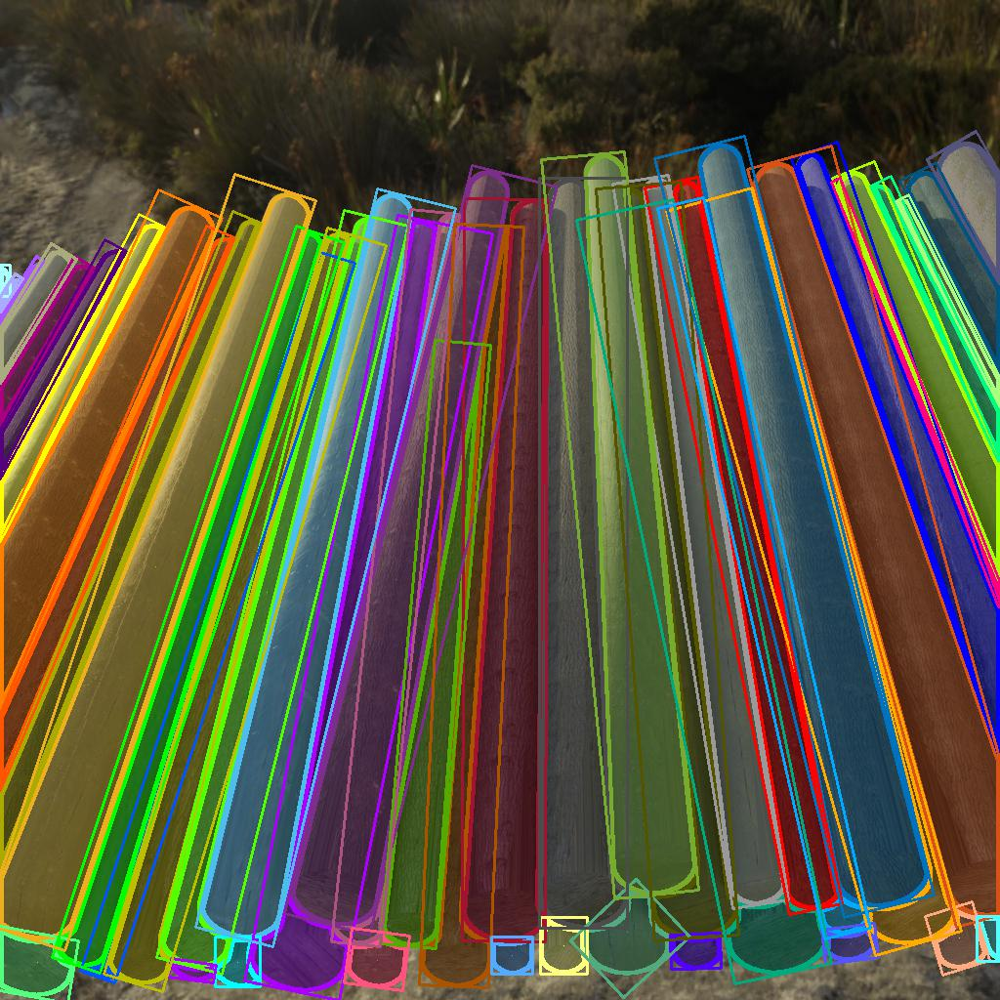
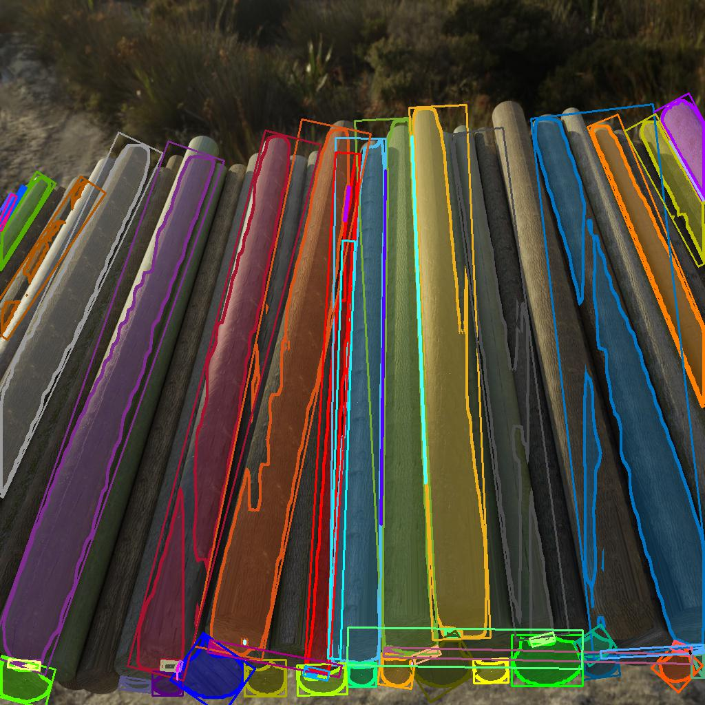

<head>
    <meta charset="UTF-8">
    <title>iShape datasets Project Page</title>
    <meta name="description" content="Irregular Shape Instance Segmentation">
    <meta name="keywords" content="irregular Shape, instance segmentation, overlap, connected components">
    <link rel="shortcut icon" href="./favicon.ico">
</head>

<details>
<summary>
<b>Update:</b> Segment Anything (SAM) references our iShape 🥳 
</summary>
<br>

<div align="center">
<a href="image/ishape_img/sam.png">
  
</a>
</div>
<br>

SAM's experiments <a href="https://arxiv.org/abs/2304.02643">[link]</a> demonstrate that iShape dataset possesses the highest quality ground truth (GT) and is also the most challenging segmentation dataset. iShape dataset can serve as a multimodal benchmark for Artificial General Intelligence (AGI).

---

</details>

<div align="center">

# iShape: Irregular Shape Instance Segmentation

**[Lei Yang<sup>1</sup>](https://github.com/DIYer22) &nbsp;&nbsp;&nbsp; Ziwei Yan<sup>2</sup> &nbsp;&nbsp;&nbsp; [Yisheng He<sup>3</sup>](https://scholar.google.com/citations?user=UM4qFCsAAAAJ&hl=en) &nbsp;&nbsp;&nbsp; Wei Sun<sup>1</sup>&nbsp;&nbsp;&nbsp; Zhenhang Huang<sup>4</sup>&nbsp;&nbsp;&nbsp; Haikun Zhang<sup>4</sup> &nbsp;&nbsp;&nbsp; [Haibin Huang<sup>5</sup>](https://brotherhuang.github.io/) &nbsp;&nbsp;&nbsp; [Haoqiang Fan<sup>1</sup>](https://scholar.google.com/citations?user=bzzBut4AAAAJ&hl=en)**

<sup>1</sup>Megvii Research Beijing, Megvii Technology Ltd., Beijing, China    
<sup>2</sup>School of Software, Beihang University, Beijing, China    
<sup>3</sup>Hong Kong University of Science and Technology, Hong Kong, China   
<sup>4</sup>Beijing University of Chemical Technology, Beijing, China  
<sup>5</sup>Kuaishou Technology, Beijing, China  


<div align="center">

<br>
<a href="image/ishape_img/wire5.png">
  
</a>
<a href="image/ishape_img/wire-inst.png">
  
</a>


<p style="width:670px; text-align: justify">A typical scene of objects with irregular shape and similar appearance. It has many characteristics that challenge instance segmentation algorithms, including the large overlaps between bounding boxes of objects, extreme aspect ratios (bounding box of the grey mask), and large numbers of connected components in one instance (green and blue masks).</p>

<br>

</div>


---

 ### [Abstract](#1-abstract) | [Paper](#2-paper) | [Dataset](#3-our-ishape-dataset) | [Baselines](#4-our-baseline-arbitrary-shape-instance-segmentation) | [Benchmark](#5-benchmark) | [Misc](#6-misc)
 
  <!-- | [Leaderboard](#5-Leaderboard) | [iShape-tool](#6-rpc-tool)  -->

</div>

## 1. Abstract

<p style="text-align: justify"><em>&nbsp;&nbsp;&nbsp;&nbsp;&nbsp;In this paper, we introduce a brand new dataset to promote the study of instance segmentation for objects with irregular shapes. Our key observation is that though irregularly shaped objects widely exist in daily life and industrial scenarios, they received little attention in the instance segmentation field due to the lack of corresponding datasets. To fill this gap, we propose iShape, an irregular shape dataset for instance segmentation. iShape contains six sub-datasets with one real and five synthetics, each represents a scene of a typical irregular shape. Unlike most existing instance segmentation datasets of regular objects, iShape has many characteristics that challenge existing instance segmentation algorithms, such as large overlaps between bounding boxes of instances, extreme aspect ratios, and large numbers of connected components per instance. We benchmark popular instance segmentation methods on iShape and find their performance drop dramatically. Hence, we propose an affinity-based instance segmentation algorithm, called ASIS, as a stronger baseline. ASIS explicitly combines perception and reasoning to solve <b>A</b>rbitrary <b>S</b>hape <b>I</b>nstance <b>S</b>egmentation including irregular objects. Experimental results show that ASIS outperforms the state-of-the-art on iShape.</em></p>

## 2. Paper

<div align="center">

<a href="https://arxiv.org/abs/2109.15068">
    
</a>   

<br>
<br>

[**Paper on arXiv => "Irregular Shape Instance Segmentation"**](https://arxiv.org/abs/2109.15068) | [**Appendix**](https://ylshare.oss-cn-shanghai.aliyuncs.com/iShape-appendix.pdf)
</div>

## 3. Our iShape dataset 

In this work, we present iShape, a new dataset designed for **i**rregular **Shape** instance segmentation. Our dataset consists of six sub-datasets, namely iShape-Antenna, iShape-Branch, iShape-Fence, iShape-Log, iShape-Hanger, and iShape-Wire. As shown in  picture below, each sub-dataset represents scenes of a typical irregular shape, for example, strip shape,  hollow shape, and mesh shape.

<div align="center">


</div>

### Download iShape dataset (4.5GB):

<!-- **Download on [=> Kaggle](https://www.kaggle.com/diyer22/ishape-irregular-shape-instance-segmentation)** -->

**iShape download URL:**  
<p>&nbsp;&nbsp;&nbsp;&nbsp;&nbsp; http://113.44.140.251:9000/ishape/ishape_dataset.tar </p>

Or backup URL:  
<p>&nbsp;&nbsp;&nbsp;&nbsp;&nbsp; https://ylshare.oss-cn-shanghai.aliyuncs.com/ishape_dataset.tar </p>

```bash
$ md5sum ishape_dataset.tar
# 2b3bd15e6ec762bbc03dddc5e4bc24df
```

<!-- ### Browse iShape dataset online with visualization: => [ishape_dataset](http://39.105.21.95:9000/ishape/) -->

**Dataset format:** iShape provides both Cityscapes and COCO style instance segmentation annotations.
- Cityscapes style: store as `*.png` files under directory `instance_map`. Similar to `*_instanceIds.png` in Cityscapes dataset, those png file are Height * Width * 16bit. Each pixel value `x` means that the pixel belongs to the instance ID is `x`.
- COCO style: It should be pointed out that the COCO style annotations encode masks by [Run-Length Encoding(RLE)](https://en.wikipedia.org/wiki/Run-length_encoding), because polygon can not represent hollow-shaped masks.

<!-- **Overview infomation of the iShape dataset:** 

<div align="center">

| **# sub-datasets** | **# imgages** | **# instances** | **# instance/image** |
| ------------------ | ------------: | --------------: | -------------------: |
| iShape-Antenna     |           370 |           3,036 |                 8.20 |
| iShape-Branch      |         2,500 |          26,046 |                10.14 |
| iShape-Fence       |         2,500 |           7,870 |                 3.15 |
| iShape-Hanger      |         2,500 |          49,275 |                19,71 |
| iShape-Log         |         2,500 |          72,144 |                28.86 |
| iShape-Wire        |         2,500 |          17,469 |                 6.99 |

</div> -->

**Source code about the dataset:**
- [**`build_synthetic_ishape`**](https://github.com/iShape/build_synthetic_ishape): Source code of building iShape synthetic data.
- [**`bpycv`**](https://github.com/DIYer22/bpycv): Computer vision utils for open-source CG software [Blender](https://www.blender.org/).
  
**Dataset license:** [Public domain (CC0)](https://creativecommons.org/publicdomain/zero/1.0/)    


## 4. Our Baseline: Arbitrary Shape Instance Segmentation

<p style="text-align: justify"> We introduce a stronger baseline considering irregular shape in this paper, which explicitly combines perception and reasoning. Our key insight is to simulate how a person identifies an irregular object. Taking the wire shown in Figure 1 for example, one natural way is to start from a local point and gradually expand by following the wire contour and figure out the entire object. The behavior of such ``following the contour'' procedure is a process of <b>continuous iterative reasoning based on local clues</b>, which is similar to the recent affinity-based approaches . Under such observation, we propose a novel affinity-based instance segmentation baseline, called ASIS, which includes principles of generating effective and efficient affinity kernel based on dataset property to solve <b>A</b>rbitrary <b>S</b>hape <b>I</b>nstance  <b>S</b>egmentation. Experimental results show that the proposed baseline outperforms existing state-of-the-art methods by a large margin on iShape.</p>


<div align="center">

<br>

  


<p style="width:705px; text-align: justify"><b>Overview of ASIS.</b> In the training stage, the network learns to predict the semantic segmenation as well as the affinity map. In the inference stage, first, build graph operation transforms the predicted affinity map into a sparse undirected graph by setting pixels as nodes and the affinity between pixels as edges. Then the graph merge algorithm is applied to the graph. The algorithm will cluster the pixels to yield class-agnostic instance segmentation. Finally, the class assign module will add a category with confidence to each instance using the result of semantic segmentation.</p>

<br>

</div>

### **Baseline code will release soon.**

## 5. Benchmark
We also benchmark existing instance segmentation algorithms on iShape and find their performance degrades significantly.

#### 5.1 Experimental results

Qualitative results on iShape. We report the mask mmAP of six sub-datasets and the average of mmAP. To be fair, all methods use ResNet-50 as the backbone. \`\`w/o'' denotes \`\`without''.

<div align="center" >


| Method            | Antenna | Branch | Fence | Hanger |  Log | Wire | Average | Config                                                                                         | Download                                                                                                                                                                                     | Code                                                   |
| ----------------- | ------: | -----: | ----: | -----: | ---: | ---: | ------: | ---------------------------------------------------------------------------------------------- | -------------------------------------------------------------------------------------------------------------------------------------------------------------------------------------------- | ------------------------------------------------------ |
| SOLOv2            |     6.6 |**27.5**|   0.0 |   28.8 | 22.2 |  0.0 |   14.07 | config                                                                                         | model \| [log](https://drive.google.com/drive/folders/1IIRrz-w7H6cLLkiHGqqFqbaj50v0ZcKD?usp=sharing)                                                                                         | [Link](https://github.com/WXinlong/SOLO)               |
| PolarMask         |     0.0 |    0.0 |   0.0 |    0.0 | 18.6 |  0.0 |    3.10 | [config](https://drive.google.com/drive/folders/1QbsVJe4jL-6j5Dvth-7a2mpgGYkEPk2a?usp=sharing) | model \| [log](https://drive.google.com/drive/folders/1QbsVJe4jL-6j5Dvth-7a2mpgGYkEPk2a?usp=sharing)                                                                                         | [Link](https://github.com/xieenze/PolarMask)           |
| SpatialEmbeddings |    38.3 |    0.0 |   0.0 |   49.8 | 20.9 |  0.0 |   18.17 | config                                                                                         | [model](https://drive.google.com/drive/folders/1WzmoqaKBPcvrQOy2yX_4T103I2knx7Fj?usp=sharing) \| [log](https://drive.google.com/drive/folders/1WzmoqaKBPcvrQOy2yX_4T103I2knx7Fj?usp=sharing) | [Link](https://github.com/davyneven/SpatialEmbeddings) |
| Mask RCNN         |    16.9 |    4.2 |   0.0 |   22.1 | 32.6 |  0.0 |   12.63 | config                                                                                         | model \| [log](https://drive.google.com/drive/folders/1CCS3xYmFvLG9FUUV-bQpbGwU4oyJowCa?usp=sharing)                                                                                         | [Link](https://github.com/facebookresearch/detectron2) |
| DETR              |     2.1 |    2.6 |   0.0 |   32.2 | 46.2 |  0.0 |   13.85 | [config](https://drive.google.com/drive/folders/1gYvJjMn8d5LZoc2BUMj8wGxeB57wYhwK?usp=sharing) | model \| [log](https://drive.google.com/drive/folders/1gYvJjMn8d5LZoc2BUMj8wGxeB57wYhwK?usp=sharing)                                                                                         | [Link](https://github.com/facebookresearch/detr)       |
| GMIS*             |    67.6 |   14.9 |  30.6 |   24.8 | 63.2 | 46.1 |   41.21 | config                                                                                         | model \| log                                                                                                                                                                                 | Link                                                   |
| ASIS without OHEM     |    82.1 |   17.6 |  48.0 |   40.5 | 66.4 | 66.5 |   53.51 | config                                                                                         | model \| log                                                                                                                                                                                 | Link                                                   |
| ASIS(ours)        | **88.5** | 24.6 | **60.4** | **57.4** | **69.4** | **77.3** | **62.93** | config                                                                                         | model \| log                                                                                                                                                                                 | Link                                                   |

</div>

#### 5.2 Qualitative results 

Click to open the big image.

<table style="overflow: hidden;">
  <tbody>
    <tr style="padding:0px;">
      <th>Ground Truth</th>
      <th>Mask RCNN</th>
      <th>SOLOv2</th>
      <th>Ours</th>
    </tr>
    <tr class="content">
      <td style="padding:0px;">
        <a href="image/vis_tmp/gt/antenna/4165.jpg">
          
        </a>
      </td>
      <td style="padding:0px;">
        <a href="image/vis_tmp/maskrcnn/antenna/4165.jpg">
          
        </a>
      </td>
      <td style="padding:0px;">
        <a href="image/vis_tmp/solov2/antenna/4165.jpg">
          
        </a>
      </td>
      <td style="padding:0px;">
        <a href="image/vis_tmp/asis/antenna/4165.jpg">
          
        </a>
      </td>
    </tr>
    <tr class="content">
      <td style="padding:0px;">
        <a href="image/vis_tmp/gt/branch/30.jpg">
          
        </a>
      </td>
      <td style="padding:0px;">
        <a href="image/vis_tmp/maskrcnn/branch/30.jpg">
          
        </a>
      </td>
      <td style="padding:0px;">
        <a href="image/vis_tmp/solov2/branch/30.jpg">
          
        </a>
      </td>
      <td style="padding:0px;">
        <a href="image/vis_tmp/asis/branch/30.jpg">
          
        </a>
      </td>
    </tr>
    <tr class="content">
      <td style="padding:0px;">
        <a href="image/vis_tmp/gt/fence/103.jpg">
          
        </a>
      </td>
      <td style="padding:0px;">
        <a href="image/vis_tmp/maskrcnn/fence/103.jpg">
          
        </a>
      </td>
      <td style="padding:0px;">
        <a href="image/vis_tmp/solov2/fence/103.jpg">
          
        </a>
      </td>
      <td style="padding:0px;">
        <a href="image/vis_tmp/asis/fence/103.jpg">
          
        </a>
      </td>
    </tr>
    <tr class="content">
      <td style="padding:0px;">
        <a href="image/vis_tmp/gt/hanger/366.jpg">
          
        </a>
      </td>
      <td style="padding:0px;">
        <a href="image/vis_tmp/maskrcnn/hanger/366.jpg">
          
        </a>
      </td>
      <td style="padding:0px;">
        <a href="image/vis_tmp/solov2/hanger/366.jpg">
          
        </a>
      </td>
      <td style="padding:0px;">
        <a href="image/vis_tmp/asis/hanger/366.jpg">
          
        </a>
      </td>
    </tr>
    <tr class="content">
      <td style="padding:0px;">
        <a href="image/vis_tmp/gt/log/103.jpg">
          
        </a>
      </td>
      <td style="padding:0px;">
        <a href="image/vis_tmp/maskrcnn/log/103.jpg">
          
        </a>
      </td>
      <td style="padding:0px;">
        <a href="image/vis_tmp/solov2/log/103.jpg">
          
        </a>
      </td>
      <td style="padding:0px;">
        <a href="image/vis_tmp/asis/log/103.jpg">
          
        </a>
      </td>
    </tr>
    <tr class="content">
      <td style="padding:0px;">
        <a href="image/vis_tmp/gt/wire/212.jpg">
          
        </a>
      </td>
      <td style="padding:0px;">
        <a href="image/vis_tmp/maskrcnn/wire/212.jpg">
          
        </a>
      </td>
      <td style="padding:0px;">
        <a href="image/vis_tmp/solov2/wire/212.jpg">
          
        </a>
      </td>
      <td style="padding:0px;">
        <a href="image/vis_tmp/asis/wire/212.jpg">
          
        </a>
      </td>
    </tr>
  </tbody>
</table>


<br>
<div align="center">
<div align="center" style="width:300px">

[](ishape_experiment.html)  
More qualitative results are [=> **here**](ishape_experiment.html)

</div>
</div>

<!-- 
## 5. Leaderboard


<div style="text-align: justify">

[**iShape-Leaderboard**]()

If you have been successful in creating a model based on the training set and it performs well on the validation set, we encourage you to run your model on the test set. The  [`rpctool`]() (in the next section in this project page) will contribute to return the corresponding results of the evaluation metrics. You can submit your results on the RPC leaderboard by creating a new issue. Your results will be ranked in the leaderboard and to benchmark your approach against that of other machine learners. We are looking forward to your submission. Please click [here]() to submit.

</div> -->


## 6. Misc

If you have any questions about iShape, feel free to submit an issue here: [issues](https://github.com/iShape/iShape.github.io/issues).

<!-- ## 6. ATTN

<div style="text-align: justify">

This dataset and code packages are free for academic usage. You can run them at your own risk. For other purposes, please contact the corresponding author Lei Yang (yanglei@megvii.com).

</div> -->


<!-- Global site tag (gtag.js) - Google Analytics -->
<script async src="https://www.googletagmanager.com/gtag/js?id=G-NGRJZ0J17J"></script>
<script>
  window.dataLayer = window.dataLayer || [];
  function gtag(){dataLayer.push(arguments);}
  gtag('js', new Date());

  gtag('config', 'G-NGRJZ0J17J');
</script>
